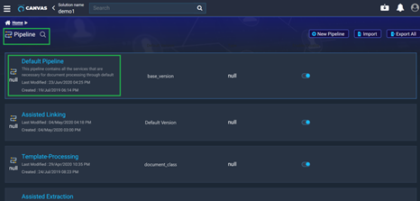

# 3.Creating Custom Service

·       REST is one of the most common web service being used by most web applications nowadays.

·       Instead of using XML to make a request, REST relies on a simple URL in many cases.

·       Enso allows you to setup the REST Automation in less than a minute. This let’s you setup the End point URL of the service.

·       Once the service URL and required parameters have been setup, you can preview the REST Response by just a click of a button.

·       Enso provides this feature of scaling up the capability of the solution built by using the third party API’s by creating a Custom Service.

·       Creating a custom service makes it easier for the user to use a varied set of functionalities, and not just limiting to the default set.

**Steps to create a custom service:**

1\)           Select the solution and click on Services.

2\)          A screen as shown below appears. Click on “New Service”.

3\)     Enter the Service Name and Service Key and click on Proceed.

4\)         Input the “Service end point” , “Header” and select “Post” and click on Save.

5\)         In the search icon next to Services, search for the newly created service. It will be enabled as shown below.

 6\)            Click on Edit, to test the service.

7\)            Click on Test Service.

8\)         In the “Test Service” space give the service payload which is the json code and click on Test.

9\)           The output of the payload will be displayed as shown below.

10\)       To use the created service in a pipeline, go to Pipeline and select the pipeline to be used.

11\)      Click on the pipeline and click on View from the drop down.

12\)      Drag the service task and place it at the required place in the pipeline. In the services pane, type the newly created service and it appears in the drop down list.

13\)      Click on that service and the Service task will be assigned with the newly created Service which can be implemented in the pipeline.

